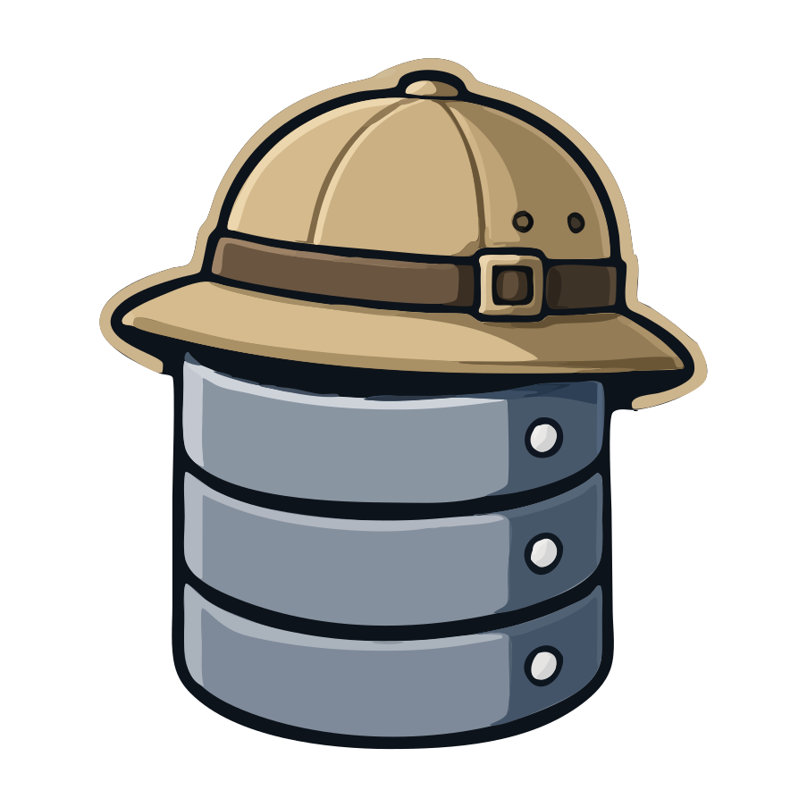
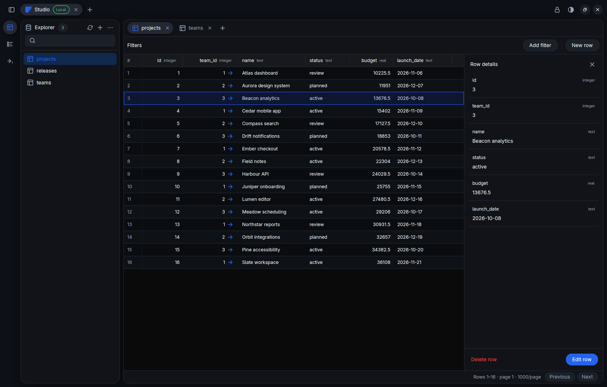
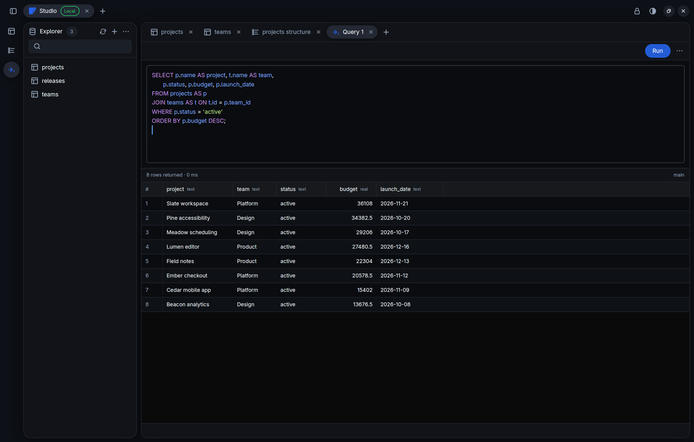

<p align="center">
  
</p>

<h1 align="center">DBX</h1>
<p align="center">A native database workbench. Built with Rust and GPUI.</p>
<p align="center">PostgreSQL · MySQL · SQLite · Redis · MongoDB · CockroachDB · DuckDB · Elasticsearch · BigQuery · Kafka · Turso · Cloudflare D1 · ClickHouse</p>

Browse your data, follow relationships, edit rows, and run queries in a responsive desktop app. DBX uses [GPUI](https://github.com/zed-industries/zed/tree/main/crates/gpui) for its window, input, and GPU rendering.



**DBX is in active development.** It is runnable today, but should not yet be treated as a production database administration tool. Start with a disposable database and a least-privilege account.

## Inside the workbench

- **Thirteen database connectors:** SQL databases, document stores, Elasticsearch indices and Kafka topics, with provider-specific editors and bounded browsing. See the [connector guide](docs/database-connectors.md) for connection formats and supported operations. Supabase connects through PostgreSQL.
- **A tabbed workspace:** simultaneous connections, independent table/query/structure tabs, and a searchable schema explorer.
- **Data you can work with:** virtualized grids over bounded row pages, structured filters, foreign-key navigation, and an all-field row inspector.
- **Explicit edits:** typed insert/update drafts, Value/NULL/Default states, primary-key-guarded updates and deletes, and confirmations for truncate/drop.
- **A query editor:** syntax highlighting, SQL completion, result grids, and per-connection query history.
- **Bring your own query agent:** describe queries using Claude, Cursor, Codex, OpenCode or GitHub Copilot CLI, with saved agent/model defaults and schema context. See [agent setup](docs/query-agents.md).
- **Import and export:** SQL, CSV, and TSV transfers; database exports with table selection, gzip, and schema-only SQL options.
- **Saved connections:** named profiles, colour-coded tags managed in Settings, connection testing, and encrypted credentials in the DBX Vault.
- **Socket and SSH connections:** local Unix sockets and SSH forwarding to TCP endpoints or remote sockets for PostgreSQL, MySQL, and Redis.
- **Native appearance:** light, dark, and system themes, with an option to reduce transparency.

### Write SQL, see the results



Screenshots show the real Linux application with fictional SQLite demo data and reduced transparency enabled. macOS uses its native window controls.

## Build from source

### Prerequisites

- **Rust 1.97 or newer**, with Cargo. The minimum version is declared in [Cargo.toml](Cargo.toml).
- **Git**, a native C/C++ build toolchain, and **CMake** for native dependencies.
- **macOS:** Xcode and its command-line tools, including the Metal tooling required by GPUI. Open Xcode once to complete setup, then check `xcode-select -p`. See [GPUI/Zed's macOS build guide](https://zed.dev/docs/development/macos) for current platform requirements.
- **Linux:** a Wayland or X11 desktop, a working Vulkan driver, `pkg-config`, and development libraries for XCB, xkbcommon, and fontconfig. Distribution package names vary; [Zed's Linux dependency guide](https://zed.dev/docs/development/linux) is a useful reference for GPUI's platform dependencies. A desktop file portal is needed for native file dialogs.
- **Optional:** Docker Compose for the disposable PostgreSQL/MySQL/Redis/ClickHouse integration suite; Python 3 for the Linux UI fixtures.

```bash
git clone https://github.com/jrmd/dbx.git
cd dbx

rustup toolchain install stable
rustup override set stable
```

The first build fetches the GPUI and gpui-component Git dependencies and compiles the native stack, so allow extra time and disk space.

### Linux

```bash
# Build and launch the app.
cargo run --locked --release --package dbx-ui

# Or stage a distributable directory and archive.
make linux-build

# Build and launch through the packaging helper.
make linux-run

# Build a single-file AppImage.
make linux-appimage
```

`make linux-build` produces:

- `target/linux/DBX/usr/bin/dbx`
- Desktop metadata and the SVG icon under `target/linux/DBX/usr/share/`
- `target/linux/DBX-VERSION-linux-x86_64.tar.gz` and its `.sha256` checksum

The archive contains a Linux staging tree. The destination machine still needs compatible system libraries and graphics drivers. The raw Cargo binary is `target/release/dbx`.

`make linux-appimage` also produces `target/linux/DBX-VERSION-linux-x86_64.AppImage` and its checksum. It uses the host's X11/Wayland, xkbcommon, Vulkan driver, and fonts. The first run downloads [appimagetool](https://github.com/AppImage/appimagetool) into `target/linux/tools/`. Build on an older distribution, as the release workflow does on Ubuntu 22.04, so the AppImage runs on systems with older glibc.

The AppImage updates itself in place when its file is in a writable directory.
For a user-owned install from the release tarball that supports in-app updates, extract the tarball
and copy its `usr/` contents into `~/.local/` (binary, desktop file, and icon).
The app needs a writable installation directory to update itself. System package
installs should be updated through their package manager.

### Updates and GitHub releases

DBX checks stable [GitHub releases](https://github.com/jrmd/dbx/releases) on launch
and every six hours. Open **Settings** to install an available version and read
its release notes. Downloads show byte progress, retry transient failures up to
three times, and are verified against the release SHA-256 checksum before
replacement. macOS also requires the same Apple signing team and Gatekeeper
acceptance. Installation keeps the current session open. **Restart DBX** closes
open sessions; finish your work before clicking it. You can also use **Check for
Updates…** in the native Mac app menu. Set `DBX_DISABLE_UPDATES=1` to disable
background checks (useful for development, QA, and package-managed installs).
Failures appear in Settings with a notification even if the dialog is closed.
The app distinguishes checksum download, archive download, verification, and
installation so a failed attempt can be diagnosed without guessing its stage.

### Unix sockets and SSH tunnels

For PostgreSQL, MySQL, or Redis, enable **Use Unix socket** in the connection
form. Enter an absolute directory for PostgreSQL (for example,
`/var/run/postgresql`); its database port selects `.s.PGSQL.PORT` inside that
directory. MySQL and Redis take an absolute socket file path. The database host
is ignored in socket mode. SQLite continues to use a local database file.

Enable **Connect through SSH tunnel** and enter the SSH host, port, and username.
Leave the key field blank to use your existing OpenSSH agent/config, or choose
a private key file. Load encrypted keys into your agent first. DBX uses key/agent
authentication; SSH password prompts are not supported. Connect to a new SSH
host from a terminal first to verify and save its host key. DBX refuses unknown
or changed host keys and binds forwarding only on loopback. This follows
[OpenSSH's forwarding and authentication behavior](https://man.openbsd.org/ssh).

The database host/port are interpreted from the SSH server. Enabling both socket
and SSH modes forwards to a socket on that server. Test Connection, Connect,
and saved profiles use the same settings; the tunnel closes when its engine is
released. TLS options are retained. The current SQL drivers cannot preserve TLS
hostname verification through loopback forwarding, so DBX rejects `verify-full`
and MySQL `verify_identity` in SSH mode; use a direct connection for those modes.

The [release workflow](.github/workflows/release.yml) runs on `vVERSION` tags
matching the workspace version. It builds Linux x86_64 on Ubuntu 22.04 and signed,
notarized macOS Apple Silicon bundles; Intel Macs are not supported. All tests and both builds
must succeed; assets are uploaded to a draft before the complete release is
published. The existing Mac candidate workflow remains available for testing.
See [release setup](docs/macos-release.md) for the required Apple secrets.

### macOS

After installing Xcode and launching it once, prepare the toolchain:

```bash
xcode-select --install
sudo xcode-select --switch /Applications/Xcode.app/Contents/Developer
brew install cmake
```

The command-line tools installer may report they are already installed. If GPUI reports that `metal` is missing, follow the [Metal toolchain troubleshooting steps](https://zed.dev/docs/development/macos#troubleshooting) before rebuilding.

```bash
# Build DBX.app and sign it with your own local identity.
make build

# Build, sign, and open it.
make run

# Build and replace /Applications/DBX.app.
make install
```

The bundle is `target/macos/DBX.app`, including its Finder icon. `make install` quits DBX and replaces the installed copy. To install somewhere else:

```bash
mkdir -p "$HOME/Applications"
make install INSTALL_DIR="$HOME/Applications"
```

For terminal logs, use `DBX_FOREGROUND=1 make run`. `make macos-build` and `make macos-run` are aliases for `make build` and `make run`. Prefer this bundle workflow on Mac so rebuilds retain a consistent signing identity. `make cargo-build` and `make cargo-run` are also available for the raw Cargo workflow.

## Your own Mac signing key

**You do not need the maintainer's signing key or a paid Apple Developer account to build and run DBX on your Mac.** For maintainer-signed release candidates, see the [macOS release workflow](docs/macos-release.md). The tag-triggered release workflow publishes notarized bundles only after all platform builds and validation succeed.

On the first `make build` or `make run`, [the Mac build helper](scripts/build-macos-app.sh) creates a self-signed **DBX Local Development** code-signing certificate and its private key in your login keychain. Later builds reuse that identity to sign the bundle with identifier `dev.jrmd.dbx`. macOS may ask you to unlock the keychain or allow `codesign` to use the key.

Keep the same identity for subsequent builds. It helps preserve access to the Keychain item used by **Unlock automatically on this device**; replacing the certificate or using ad-hoc signatures may cause new access prompts. The signing key is separate from your vault passphrase and database credentials.

### If automatic certificate creation fails

Create the local identity once in **Keychain Access**:

1. Choose **Keychain Access → Certificate Assistant → Create a Certificate**.
2. Set **Name** to `DBX Local Development`.
3. Set **Identity Type** to **Self Signed Root**.
4. Set **Certificate Type** to **Code Signing**.
5. Save it in the **login** keychain, including its private key.
6. Run `make run` again.

Check the available identities and the finished bundle:

```bash
security find-identity -v -p codesigning "$HOME/Library/Keychains/login.keychain-db"
codesign --verify --deep --strict --verbose=2 target/macos/DBX.app
```

To use another local certificate name or keychain, pass the same settings on every build/run/install:

```bash
DBX_SIGNING_NAME="My DBX Development" make run

DBX_KEYCHAIN="$HOME/Library/Keychains/login.keychain-db" \
DBX_SIGNING_NAME="My DBX Development" make build
```

As a temporary fallback, `DBX_SIGNING_NAME=- make run` uses ad-hoc signing without creating a certificate. This gives up the stable certificate identity and may require renewed Keychain approval after rebuilds.

### Distributing a Mac build to other people

A self-signed local build is **not notarized** and does not provide Developer ID trust on someone else's Mac. Passing `codesign --verify` checks the signature's integrity; it does not mean Gatekeeper will accept a downloaded app.

For distribution under your own identity, obtain a **Developer ID Application** certificate through your Apple Developer Program account, install it together with its private key, sign the app with the hardened runtime and a secure timestamp, then submit it for notarization and staple the accepted ticket. See [Apple's Developer ID certificate instructions](https://developer.apple.com/help/account/certificates/create-developer-id-certificates) and [notarization workflow](https://developer.apple.com/documentation/security/customizing-the-notarization-workflow).

Use `DBX_SIGNING_MODE=developer-id` with `DBX_SIGNING_NAME` for distribution builds: this requires an existing Developer ID Application identity, refuses a self-signed fallback, and adds secure timestamps. The [release workflow](docs/macos-release.md) builds on GitHub's Mac runners, notarizes and staples the bundle, verifies Gatekeeper acceptance, and uploads a candidate ZIP and checksum. Do not share or commit your private key or certificate export.

## First connection

1. Create a DBX Vault with a passphrase. Keep it somewhere safe: DBX cannot recover it.
2. Choose your database provider, or paste a connection URL to detect it. Add a connection name, a tag, and connection details; for SQLite or DuckDB, choose a database file. The [connector guide](docs/database-connectors.md) covers cloud tokens and query examples.
3. Test the connection, save it if desired, and connect.
4. Open a table, inspect a row, or create a query tab. Review the target connection before applying writes.

Saved profile metadata is password-free JSON in the platform configuration directory. Credentials are encrypted in the app-owned vault with Argon2id and XChaCha20-Poly1305. Optional device unlock stores the derived vault key in macOS Keychain or Linux Secret Service; it never stores your passphrase. Importing old system passwords is an explicit action.

## Development and checks

```bash
cargo fmt --all -- --check
cargo clippy --locked --workspace --all-targets --all-features -- -D warnings
cargo test --locked --workspace

# Disposable connector tests (requires Docker Compose).
./scripts/test-integration.sh

# Live local socket and SSH checks (Docker and OpenSSH client/server required).
python3 scripts/test-transports.py

# Isolated native UI session (Linux; requires Python 3).
./scripts/run-ui-test.sh
```

The integration script starts PostgreSQL 16, MySQL 8.4, Redis 7, and ClickHouse 26.8 on loopback-only ports, uses temporary SQLite storage, runs connector tests serially, and tears down its containers. `DBX_TEST_POSTGRES_URL`, `DBX_TEST_MYSQL_URL`, `DBX_TEST_REDIS_URL`, and `DBX_TEST_SQLITE_URL` override its defaults; point them only at disposable databases because the tests perform writes. ClickHouse uses the fixed disposable endpoint on port 58123.

The native UI launcher keeps its test vault, profiles, and database under `target/ui-test/`, separate from normal user configuration. See [desktop QA](docs/desktop-qa.md) for fixture credentials and platform checks, and [architecture](docs/architecture.md) for the core/UI boundaries.

## Scope and safety

DBX is a client, not a database privilege boundary. GUI filters and row changes use bound parameters and quoted identifiers. Raw SQL and Redis commands execute with your connection's privileges. Use least-privilege accounts and review destructive actions.

Browsing is paged and bounded; grid virtualization does not imply loading an entire database. Table creation starts from an engine-aware SQL template. Redis mutations use the command console. Migration/schema-diff workflows, server monitoring, and formal audit logs remain outside the current scope.

Never commit real connection strings, passwords, private keys, or local database files. Contributions should preserve native responsiveness and parameterized operations, with connector-level coverage for engine-specific changes.
